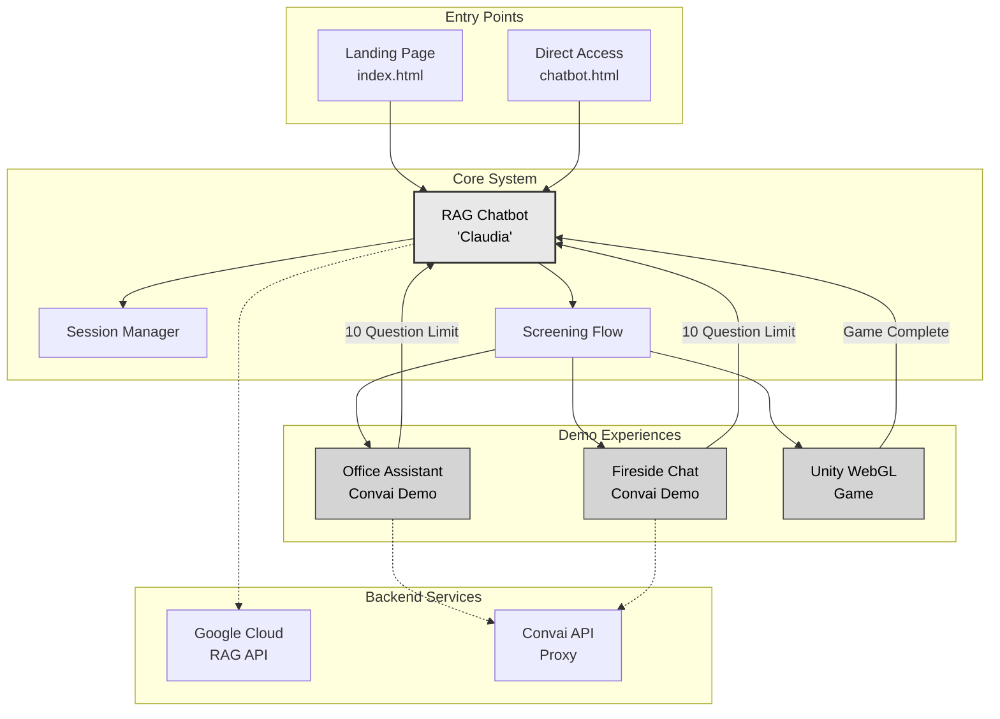
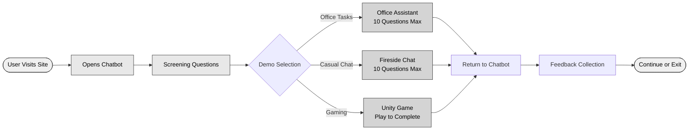

# AIGENTIC Frontend Documentation

## Project Overview

AIGENTIC is an AI chatbot demonstration platform featuring a main RAG chatbot ("Claudia") that guides users through three demo experiences: two voice-enabled Convai chatbots and a Unity WebGL game. After trying demos, users return to the main chatbot for feedback collection.

## System Architecture



## User Journey Flow



## File Structure & Purpose

```
frontend/
├── Public Pages
│   ├── index.html              # Landing page
│   ├── chatbot.html            # Main RAG chatbot
│   ├── office_chatbot.html    # Office Assistant demo
│   ├── fireside_chatbot.html  # Fireside Chat demo
│   ├── contact.html           # Contact form
│   └── [other pages]          # Supporting pages
│
└── static/
    ├── Core Scripts
    │   ├── main.js             # RAG chatbot logic, screening flow, demo routing
    │   ├── demo-chatbot.js     # Demo question counter, redirect logic
    │   ├── convai-chat.js     # Convai API, audio streaming, voice synthesis
    │   ├── session-initializer.js # Session creation/restoration
    │   └── contact.js          # EmailJS integration
    │
    ├── game/                   # Unity WebGL build
    │   └── Build/             # Game assets
    │
    └── images/                # All visual assets
```

## Key Components

### Main RAG Chatbot (`main.js`)
- **Screening Flow**: Guides users through initial questions to determine best demo
- **Demo Routing**: Redirects to appropriate demo experience based on screening
- **Session Management**: Maintains conversation context across page navigation
- **Q&A Service**: Handles open-ended questions after screening via SSE streaming

### Demo Management (`demo-chatbot.js`)
- **Question Counter**: Tracks and displays remaining questions (10 max)
- **Warning System**: Alerts at 7 and 9 questions
- **Auto-redirect**: Returns to main chatbot when limit reached
- **Session Persistence**: Maintains count across page refreshes

### Convai Integration (`convai-chat.js`)
- **Voice Streaming**: Real-time audio synthesis and playback
- **Text Streaming**: Simultaneous text display with voice
- **PCM Processing**: Gapless audio playback through WAV concatenation
- **Character Management**: Different personalities for each demo

### Session System (`session-initializer.js`)
- **Unique IDs**: Generated per user visit
- **LocalStorage**: Persists across page navigation
- **Backend Sync**: Maintains context with Google Cloud RAG

## API Endpoints

| Endpoint | Purpose | Method |
|----------|---------|--------|
| `/api/session/init` | Create/restore session | POST |
| `/api/screening/continue` | Process screening answers | POST |
| `/api/qna/query` | Open Q&A streaming | GET (SSE) |
| `/api/convai/proxy/stream` | Convai voice/text stream | GET (SSE) |

## Technical Flow Details

### Screening Process
1. User enters chatbot
2. System asks qualifying questions
3. Based on responses, recommends specific demo
4. User can accept recommendation or choose different demo
5. Redirects to selected experience

### Demo Limitations
- **Convai Demos**: Hard limit of 10 questions
- **Visual Counter**: Shows X/10 questions used
- **Warnings**: Color changes at 70% and 90% usage
- **Forced Redirect**: Automatic return at limit

### Audio Streaming Architecture
```
Convai API → Proxy → Frontend → Audio Buffer → Playback
                ↓
           Text Stream → Display
```


## Deployment
- **Hosting**: Firebase Hosting
- **Backend**: Google Cloud: rag-chabtot, qna-serivice, screening-service
- **APIs**: Convai (Voice), EmailJS (Contact)
- **Static Assets**: Firebase CDN
